# Visual Diagrams and Flowcharts

This file contains Mermaid diagram code for visualizing game systems and workflows.

## Boss Arena System Flow

Shows how boss levels work every 5th level with tree boss mechanics:

```mermaid
graph TD
    A["🎮 Level Starts"] --> B{"Level % 5 = 0?"}

    B -->|No| C["🌍 Regular Level<br/>- Procedural chunks<br/>- Scaled enemies<br/>- Reach end OR defeat all"]

    B -->|Yes| D["🏛️ Boss Arena<br/>- Special layout<br/>- Single Tree Boss<br/>- Moving platforms"]

    C --> E["🏁 Victory<br/>Continue to next level"]

    D --> F["🌲 Tree Boss Fight<br/>- Half screen height<br/>- 300 HP<br/>- Throws stone projectiles"]

    F --> G{"Boss defeated?"}
    G -->|No| H["💀 Take damage<br/>Dodge stones<br/>Climb platforms"]
    H --> F
    G -->|Yes| E

    E --> I["📈 Level +1<br/>Check for next boss"]
```

## Level Progression Fix Flow

Shows the corrected level advancement logic after fixing the double increment bug:

```mermaid
graph TD
    A["🎮 Player on Level 1"] --> B["🏁 Victory Condition Met"]

    B --> C["Victory Screen Shows:<br/>'Weiter zum Level 2'"]

    C --> D{"User clicks button?"}

    D -->|Yes| E["startNextLevel() called"]
    D -->|No| F["Wait for user action"]
    F --> D

    E --> G["nextLevel() increments:<br/>currentLevel = 1 → 2"]

    G --> H["Scene restarts with:<br/>level: 2"]

    H --> I["UI displays:<br/>'Level 2'"]

    I --> J["✅ Correct level progression"]

    style A fill:#3498db
    style C fill:#27ae60
    style I fill:#27ae60
    style J fill:#2ecc71
```

## Audio System Flow

Shows how background and victory music are managed:

```mermaid
graph TD
    A["🎮 Game Scene Starts"] --> B["🎵 Start Background Music"]

    B --> C{"Audio enabled in settings?"}
    C -->|No| D["🔇 Skip audio"]
    C -->|Yes| E["🎵 Play background music (loop)"]

    E --> F["🎮 Gameplay continues"]

    F --> G{"Victory achieved?"}
    G -->|No| F
    G -->|Yes| H["🎉 Stop background music"]

    H --> I["🎵 Play victory music (once)"]

    I --> J{"Next level or restart?"}
    J -->|Next Level| K["🔄 Restore background music"]
    J -->|Restart| L["🔄 Clean up all audio"]

    K --> B
    L --> A
```

## Game Architecture Overview

High-level system architecture with modular systems:

```mermaid
graph TB
    GS["GameSceneRefactored<br/>🎮 Main Game Scene"]

    GS --> AS["AssetLoader<br/>📦 Assets"]
    GS --> PS["PlayerSystem<br/>🏃 Player"]
    GS --> ES["EnemySystem<br/>👹 Enemies & Boss"]
    GS --> WG["WorldGenerator<br/>🌍 World & Platforms"]
    GS --> CS["CameraSystem<br/>📷 Camera"]
    GS --> CO["ControlsSystem<br/>🎮 Input"]
    GS --> PH["PhysicsSystem<br/>⚛️ Physics"]
    GS --> NS["NetworkSystem<br/>🌐 Multiplayer"]
    GS --> GM["GameStateManager<br/>🏆 Victory & Levels"]

    UI["UIScene<br/>🖥️ UI Overlay"]

    GS -.-> UI

    style GS fill:#3498db
    style UI fill:#e74c3c
```

## Usage

To render these diagrams:

1. Copy the Mermaid code from the code blocks
2. Use any Mermaid renderer (GitHub, VS Code extensions, online tools)
3. Or use the `create_diagram` tool in development conversations

## Moving Platform System Flow

Shows the physics-based movement system for moving platforms that eliminates flickering:

```mermaid
flowchart TD
    A["🎮 Game Scene Update Loop"] --> B["updateSystems()"]
    B --> C["🔄 updateMovingPlatforms()"]

    C --> D{"For each platform"}
    D --> E["📍 Get platform position"]
    E --> F["📊 Check movement data"]
    F --> G["🔍 Check boundaries"]

    G --> H{"At minY boundary?<br/>Moving up?"}
    H -->|Yes| I["⬇️ Reverse to down<br/>setVelocityY(+speed)"]

    G --> J{"At maxY boundary?<br/>Moving down?"}
    J -->|Yes| K["⬆️ Reverse to up<br/>setVelocityY(-speed)"]

    I --> L["✅ Continue movement"]
    K --> L
    H -->|No| L
    J -->|No| L

    L --> M{"More platforms?"}
    M -->|Yes| D
    M -->|No| N["🏁 Update complete"]

    subgraph "Platform State Storage"
        O["📝 Map<platformId, data><br/>- minY/maxY bounds<br/>- speed value<br/>- direction (-1/+1)"]
    end

    F -.-> O
    I -.-> O
    K -.-> O

    subgraph "Physics System"
        P["⚡ Physics Body<br/>- setVelocityY()<br/>- immovable = true<br/>- gravity = 0"]
    end

    I -.-> P
    K -.-> P

    style A fill:#e1f5fe
    style B fill:#f3e5f5
    style C fill:#e8f5e8
    style I fill:#ffebee
    style K fill:#fff3e0
    style O fill:#f1f8e9
    style P fill:#fce4ec
```

## References

- Boss Arena System: Implemented in `WorldGenerator.ts` and `EnemySystem.ts`
- Level Progression: Managed by `GameStateManager.ts`
- Audio System: Implemented in `GameSceneRefactored.ts`
- Moving Platform System: Implemented in `WorldGenerator.ts` and `GameSceneRefactored.ts`
- Architecture: Modular system design across all game systems
